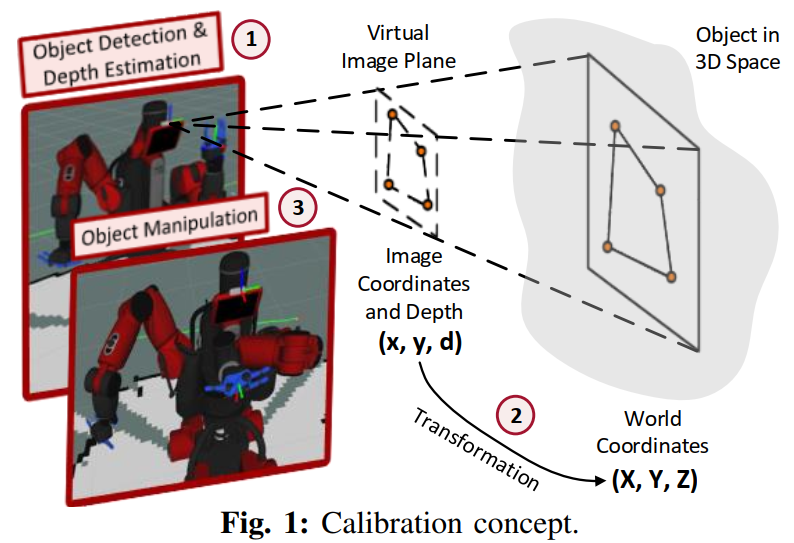
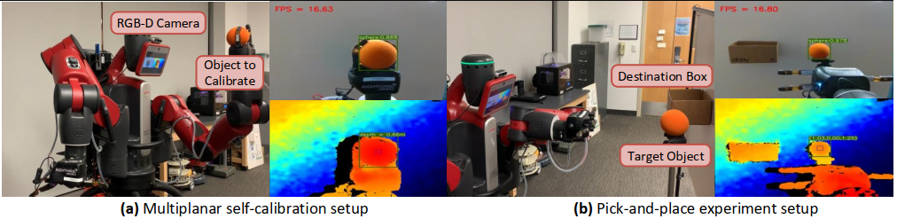
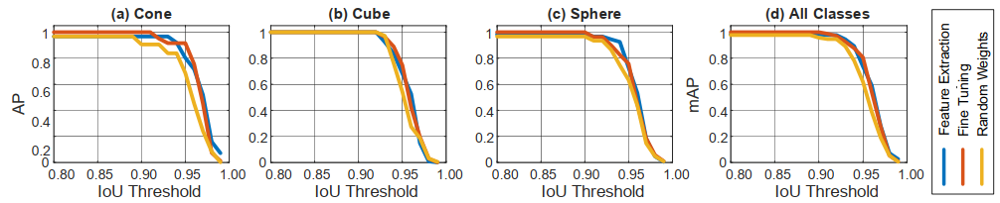
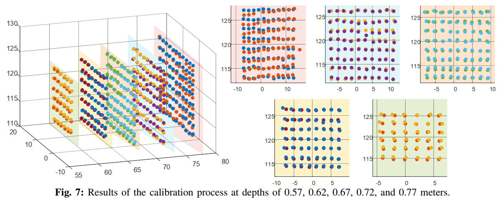

## Multiplanar Self-Calibration for Mobile Cobot 3D Object Manipulation using 2D Detectors and Depth Estimation

[Project Page]() | [Paper]() | [Video](https://youtu.be/KrDJ22rvOAo)

## Author Information
- [Tuan Dang, UT Arlington, USA](https://www.tuandang.info/)
- [Khang Nguyen, UT Arlington, USA](https://mkhangg.com/)
- [Manfred Huber, UT Arlington, USA](https://www.uta.edu/academics/faculty/profile?username=huber)

<p align="center">

</p>

# Demo

[Link](https://youtu.be/KrDJ22rvOAo)

<p align="center">

</p>


## Abstract
Calibration is the first and foremost step in robotics in dealing with displacement errors that usually occur during the operation and off-time periods to enable robots to manipulate objects precisely. In this paper, we present a novel multiplanar self-calibration between the camera system and the robot's end-effector for 3D object manipulation. Our approach first takes the robot end-effector as ground truth to calibrate the camera's position and orientation while the robot arm moves the object in multiple planes in 3D space, and a 2D state-of-the-art vision detector identifies the object's center in the image coordinates system. The transformation between world coordinates and image coordinates is then computed using 2D pixels from the detector and 3D known points obtained by robot kinematics. Next, an integrated stereo-vision system estimates the distance between the camera and the object, resulting in 3D object localization. Lastly, we test our proposed method on the Baxter robot with two 7-DOF arms and a 2D detector that can run in real time on an onboard GPU. After self-calibrating, our robot can localize objects in 3D using an RGB camera and depth image. The source code is available at [https://github.com/tuantdang/calib_cobot](https://github.com/tuantdang/calib_cobot).

## Experiments

<p align="center">

</p>

## Results
### Detector results
<p align="center">

</p>

### Calibration results
<p align="center">

</p>

## Installation

### Recommendation

- Ubuntu 20.04 or higher
- CUDA 11.1 or higher
- Python v3.7 or higher
- Pytorch v1.7 or higher
- Hardware Spec
    - GPUs 24GB (4090ti) or larger capacity

## Pre-trained Weights

You can find the pre-trained models for three strategies here.

### Pytorch models
- [Feature Transfer](https://github.com/anonymous20210107/calib_cobot/blob/main/yolov8_custom/models_v8_1000/v8_1000_freeze.pt)
- [Fined-tunning](https://github.com/anonymous20210107/calib_cobot/blob/main/yolov8_custom/models_v8_1000/v8_1000_pretrain.pt)
- [Scratch](https://github.com/anonymous20210107/calib_cobot/blob/main/yolov8_custom/models_v8_1000/v8_1000_scratch.pt)

### Onnx models running on [OpenVINO](https://www.intel.com/content/www/us/en/developer/tools/openvino-toolkit/overview.html)
- [Feature Transfer](https://github.com/anonymous20210107/calib_cobot/blob/main/yolov8_custom/models_v8_1000/v8_1000_freeze.onnx)
- [Fined-tunning](https://github.com/anonymous20210107/calib_cobot/blob/main/yolov8_custom/models_v8_1000/v8_1000_pretrain.onnx)
- [Scratch](https://github.com/anonymous20210107/calib_cobot/blob/main/yolov8_custom/models_v8_1000/v8_1000_scratch.onnx)

## Dataset
We train our custom models with our own in-lab dataset.
You can find it here [Dataset](https://github.com/anonymous20210107/calib_cobot/tree/main/yolov8_custom/3d_shapes)


## Yolov8
- Reference from [Yolov8](https://github.com/ultralytics/ultralytics)
- Our custom code for calculating Precision over IoU [Yolov8_custom](https://github.com/anonymous20210107/calib_cobot/tree/main/yolov8_custom)

## Citing

```
@inproceedings{dang2023multiplanar,
  title={Multiplanar Self-Calibration for Mobile Cobot 3D Object Manipulation using 2D Detectors and Depth Estimation},
  author={Dang, Tuan and Nguyen, Khang and Huber, Manfred},
  booktitle={2023 IEEE/RSJ International Conference on Intelligent Robots and Systems (IROS)},
  pages={1782--1788},
  year={2023},
  organization={IEEE}
}
```


## Acknowledgments
