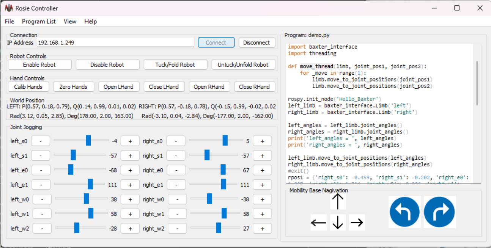

## Graphic User Interface (GUI) 

### All basic features on a window
- Teaching
- Hand control
- Joint/World monitoring
- Navigation
- Python Programming from Remote computer

The GUI is written in Python using PyQt5. Please install PyQt5:
- pip install pyqt5

## Basic sequence to control robot
- Connect to server (main unit on robot)
- Enable robot then untuck robot
- Use -/+ to move each join of robot to desired position
- Calibrate hands, then open or close hands to hold objects
- Use arrow to navigate the base of robot
- Program Python and execute from remote center/base units

